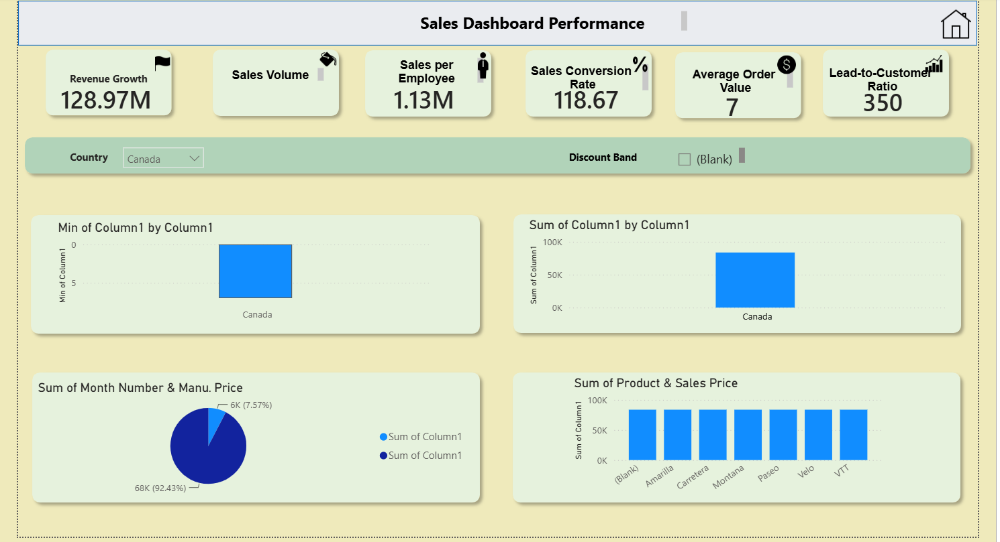
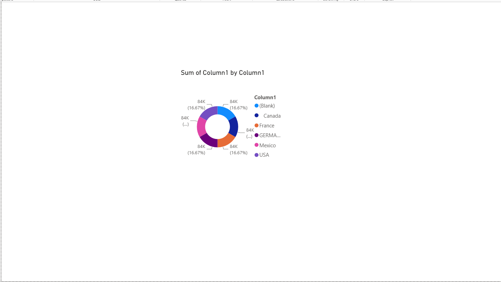

# 📊 Sales Dashboard Performance

A professional Power BI dashboard designed to analyze sales performance, revenue, customer conversion, and product insights using interactive visualizations.

---

## 📌 Project Overview

This dashboard helps businesses monitor key sales metrics and make data-driven decisions through interactive charts and KPI cards.

---

## 🚀 Features

- 📈 Revenue Growth Analysis
- 💰 Sales Volume Tracking
- 👨‍💼 Sales per Employee
- 📊 Sales Conversion Rate
- 🛒 Average Order Value
- 👥 Lead-to-Customer Ratio
- 🌍 Country Filter
- 🏷️ Discount Band Filter
- 📉 Sales Performance Charts
- 🥧 Product Distribution Analysis

---

## 🛠️ Tools Used

- Power BI
- Power Query
- DAX
- Microsoft Excel

---

## 📊 Dashboard Preview

### Home Dashboard

---

### Sales Analysis

---

## 📂 Files Included

| File | Description |
|------|-------------|
| `S2.pbit` | Power BI Template |
| `dashboard.png` | Home Dashboard Screenshot |
| `dashboard2.png` | Sales Analysis Screenshot |

---

## 📈 Key KPIs

- Revenue Growth
- Sales Volume
- Sales per Employee
- Sales Conversion Rate
- Average Order Value
- Lead-to-Customer Ratio

